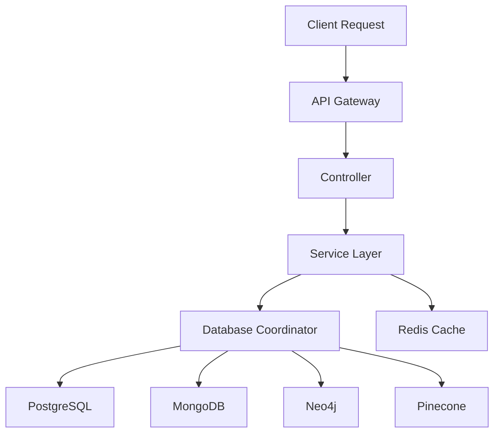

# Backend Structure Document

This technical document details the complete backend architecture of LifeOS, a web-based Life Operating System that transforms everyday experiences into a dynamic knowledge graph.

## 1. Core Architecture

LifeOS implements a clean MVC architecture with Model Context Protocol (MCP) readiness, designed for scalability and maintainability.

### 1.1 Architectural Layers

```
backend/
  routes/          # Route definitions and middleware
  controllers/     # Request handling and response formatting
  services/        # Core business logic
  protocols/       # Orchestrators for AI/DB/file workflows
  context/        # Context objects (attention, emotion, etc.)
  models/         # Data models and type definitions
  mcp/            # Model Context Protocol integration
  utils/          # Shared utilities and helpers
  config/         # Configuration management
  tests/          # Test suites
```

### 1.2 Key Components

- **Router Layer:**
  - Route definitions
  - Middleware management (auth, logging, rate limiting)
  - Request validation
  - Response formatting

- **Controller Layer:**
  - Request processing
  - Input sanitization
  - Service coordination
  - Error handling
  - Response construction

- **Service Layer:**
  - Core business logic
  - Database operations
  - External service integration
  - Event processing
  - Data transformation

- **Context Module:**
  - User context
  - Emotional state
  - Energy levels
  - Attention metrics
  - Source tracking
  - Session management

- **Protocol Layer:**
  - Journal reflection workflows
  - File upload pipelines
  - Event linking processes
  - AI processing chains
  - Data export/import procedures

### 1.3 MCP Integration

The Model Context Protocol integration enables:
- Standardized data exchange
- Workflow orchestration
- External AI model integration
- Cross-platform compatibility

## 2. Database Architecture

LifeOS employs a hybrid database approach to optimize different data types and access patterns.

### 2.1 Database Components

#### PostgreSQL (via Supabase)
- **Purpose:** Structured entity storage
- **Data Types:**
  - Users
  - People
  - Documents
  - Tags
  - Settings
  - Permissions

```sql
-- Core Entities Schema
CREATE TABLE users (
    id UUID PRIMARY KEY DEFAULT uuid_generate_v4(),
    email VARCHAR(255) UNIQUE NOT NULL,
    name VARCHAR(255),
    settings JSONB,
    created_at TIMESTAMP WITH TIME ZONE DEFAULT NOW(),
    updated_at TIMESTAMP WITH TIME ZONE DEFAULT NOW()
);

CREATE TABLE documents (
    id UUID PRIMARY KEY DEFAULT uuid_generate_v4(),
    user_id UUID REFERENCES users(id),
    title VARCHAR(255),
    content TEXT,
    metadata JSONB,
    privacy_scope VARCHAR(50),
    created_at TIMESTAMP WITH TIME ZONE DEFAULT NOW()
);

CREATE TABLE tags (
    id UUID PRIMARY KEY DEFAULT uuid_generate_v4(),
    name VARCHAR(100),
    color VARCHAR(7),
    user_id UUID REFERENCES users(id)
);
```

#### MongoDB
- **Purpose:** Flexible event stream storage
- **Collections:**
  - Events
  - Thoughts
  - Metrics
  - Actions
  - Journal entries

```javascript
// Event Schema Example
{
  _id: ObjectId,
  type: String,           // "thought" | "action" | "metric" | "journal"
  userId: UUID,
  timestamp: DateTime,
  content: {
    text: String,
    media: Array<String>, // URLs to media
    links: Array<String>  // Related resource URLs
  },
  context: {
    emotion: {
      type: String,
      intensity: Number
    },
    energy: Number,
    attention: Number,
    location: GeoJSON
  },
  metadata: {
    source: String,
    tags: Array<UUID>,
    privacy: String
  }
}
```

#### Neo4j
- **Purpose:** Semantic relationship graph
- **Node Types:**
  - Events
  - Concepts
  - People
  - Places
  - Resources

```cypher
// Core Graph Schema
CREATE 
  (event:Event {
    id: UUID,
    type: String,
    timestamp: DateTime
  }),
  (concept:Concept {
    id: UUID,
    name: String
  }),
  (person:Person {
    id: UUID,
    name: String
  }),
  (place:Place {
    id: UUID,
    name: String,
    coordinates: Point
  })

// Relationship Types
CREATE
  (event)-[:INVOLVES]->(person),
  (event)-[:OCCURS_AT]->(place),
  (event)-[:REFERENCES]->(concept),
  (event)-[:CAUSES]->(event),
  (event)-[:REFLECTS_ON]->(event)
```

#### Pinecone
- **Purpose:** Vector embeddings for AI
- **Vector Dimensions:** 1536 (OpenAI ada-002)
- **Metadata:** JSON with reference IDs and types

```javascript
// Vector Record Structure
{
  id: String,
  values: Float32Array(1536),
  metadata: {
    type: String,
    sourceId: String,
    userId: String,
    timestamp: String,
    tags: Array<String>
  }
}
```

#### Redis
- **Purpose:** Caching and session management
- **Key Patterns:**
  - `user:{id}:session`
  - `cache:ai:summary:{id}`
  - `cache:graph:{query_hash}`

### 2.2 Data Flow Patterns



## 3. AI Integration

### 3.1 Processing Pipeline

```javascript
// AI Processing Flow
const aiPipeline = {
  input: {
    text: String,
    context: Context,
    metadata: Object
  },
  steps: [
    'preprocessText',
    'generateEmbeddings',
    'semanticAnalysis',
    'relationshipExtraction',
    'insightGeneration'
  ],
  output: {
    summary: String,
    entities: Array<Entity>,
    relationships: Array<Relationship>,
    embeddings: Float32Array
  }
}
```

### 3.2 Model Integration
- OpenAI GPT-4 for text analysis
- Ada-002 for embeddings
- Custom fine-tuned models for specific tasks

## 4. API Design

### 4.1 Core Endpoints

```typescript
// Event Management
POST   /api/v1/events
GET    /api/v1/events
GET    /api/v1/events/:id
PATCH  /api/v1/events/:id
DELETE /api/v1/events/:id

// Graph Operations
POST   /api/v1/graph/relationships
GET    /api/v1/graph/query
POST   /api/v1/graph/traverse

// AI Operations
POST   /api/v1/ai/analyze
POST   /api/v1/ai/generate
POST   /api/v1/ai/embed
```

### 4.2 Request/Response Format

```typescript
// Standard Response Format
interface APIResponse<T> {
  success: boolean;
  data?: T;
  error?: {
    code: string;
    message: string;
    details?: any;
  };
  metadata: {
    timestamp: string;
    requestId: string;
  };
}
```

## 5. Security Implementation

### 5.1 Authentication
- JWT-based auth flow
- Refresh token rotation
- Multi-factor authentication support

### 5.2 Authorization
```typescript
// Permission Schema
interface Permission {
  resource: string;
  action: 'create' | 'read' | 'update' | 'delete';
  conditions: {
    ownerOnly?: boolean;
    roles?: string[];
    customRules?: Function;
  };
}
```

### 5.3 Encryption
- TLS 1.3 for transit
- AES-256 for data at rest
- End-to-end encryption for sensitive data

## 6. Monitoring and Observability

### 6.1 Metrics
- Request latency
- Error rates
- Database performance
- Cache hit rates
- AI processing times

### 6.2 Logging
```typescript
// Log Structure
interface LogEntry {
  timestamp: string;
  level: 'debug' | 'info' | 'warn' | 'error';
  service: string;
  requestId?: string;
  userId?: string;
  message: string;
  metadata: Record<string, any>;
}
```

## 7. Deployment Architecture

### 7.1 Infrastructure
- AWS Lambda for serverless functions
- S3/R2 for file storage
- CloudFront/CDN for static assets
- Load balancers for API gateway

### 7.2 Scaling Strategy
- Horizontal scaling for API servers
- Read replicas for databases
- Cache distribution
- Queue-based job processing

## 8. Development Workflow

### 8.1 Local Development
```bash
# Development Commands
npm run dev        # Start development server
npm run test      # Run test suite
npm run lint      # Check code style
npm run build     # Build for production
```

### 8.2 CI/CD Pipeline
- GitHub Actions for automation
- Automated testing
- Infrastructure as Code deployment
- Blue-green deployment strategy

This document serves as the definitive technical reference for LifeOS's backend architecture and implementation details.